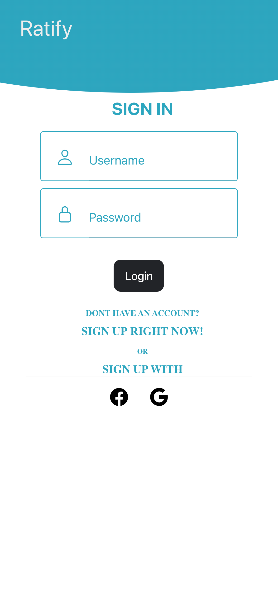
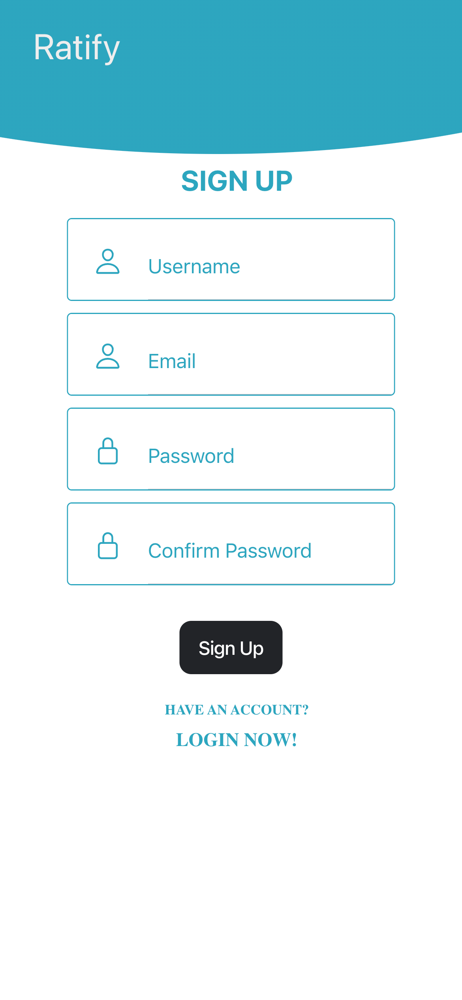
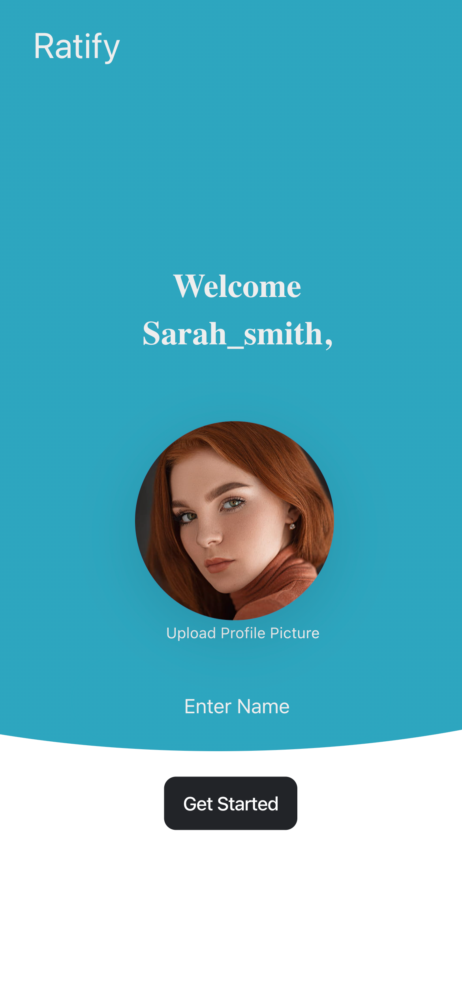
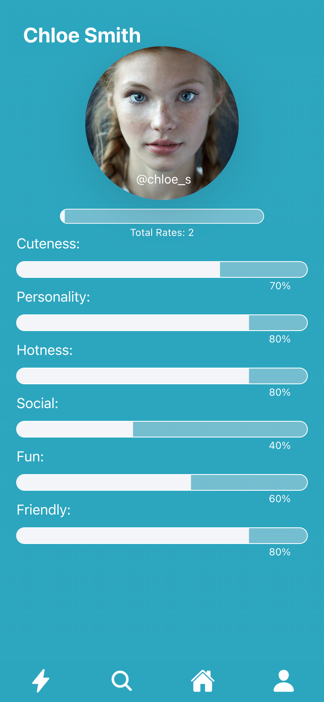
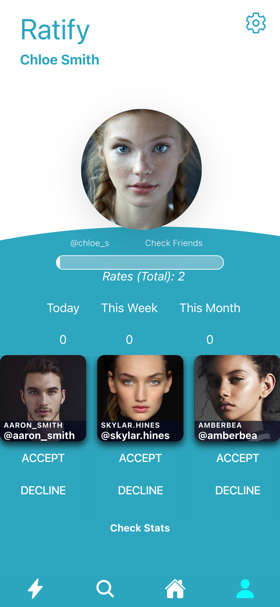
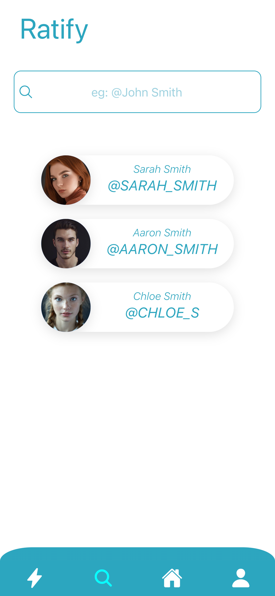
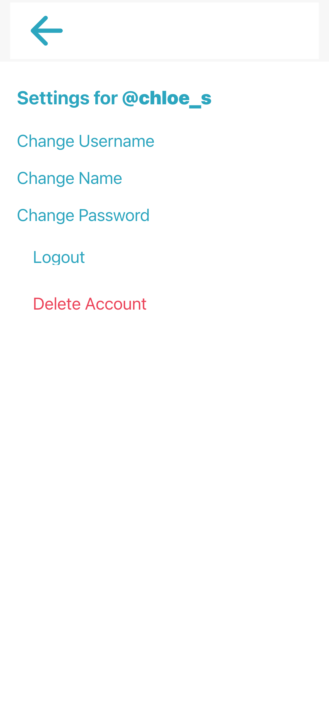
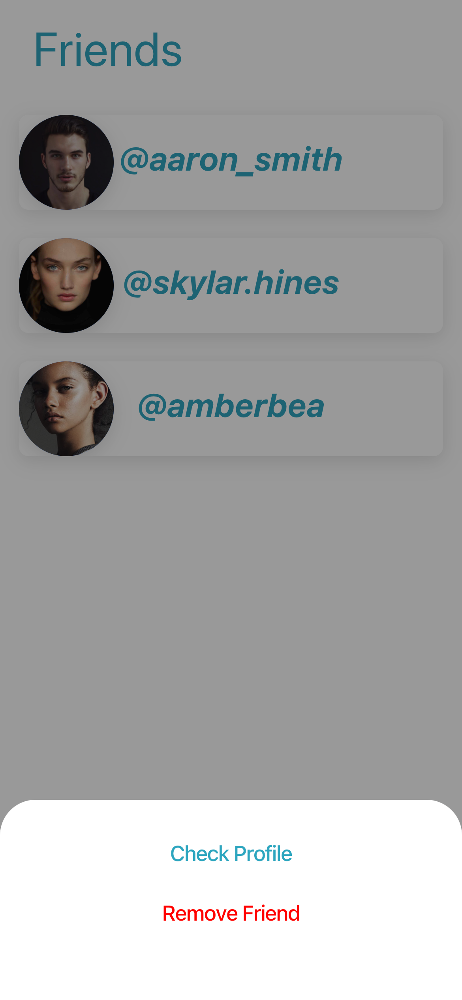

# Ratify

# Installation 
-  Clone Repository
-  run ionic serve command
-  install @angular/cli

# Database 
- You will find the database content in the database folder 
- Copy the SQL statements
- Go to http://localhost/phpmyadmin/
- Create a new database named 'ratifydb'
- Create three tables : 'users', 'rates', 'friends'
- Go to SQL tab, paste the SQL statements and hit go!

# Running the app
- Start Apache Web Server and MySQL Database Server
- run ionic serve in the command line
- url : http://127.0.0.1:8100 (Make sure not to run as localhost)

# Overview
- Ratify is an app where people rate and get rated anonymously!

# Design

